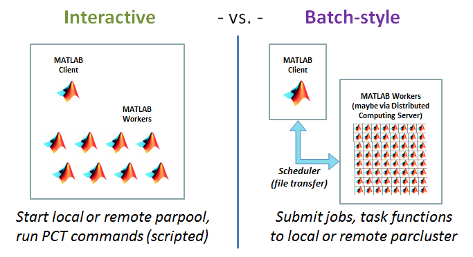
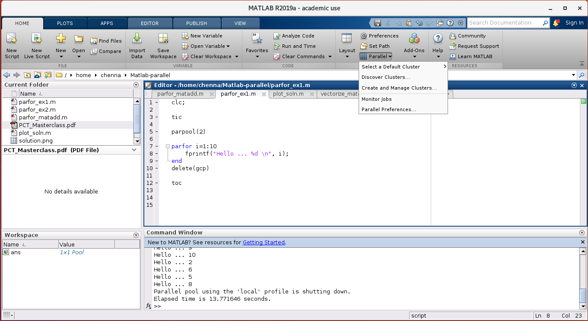
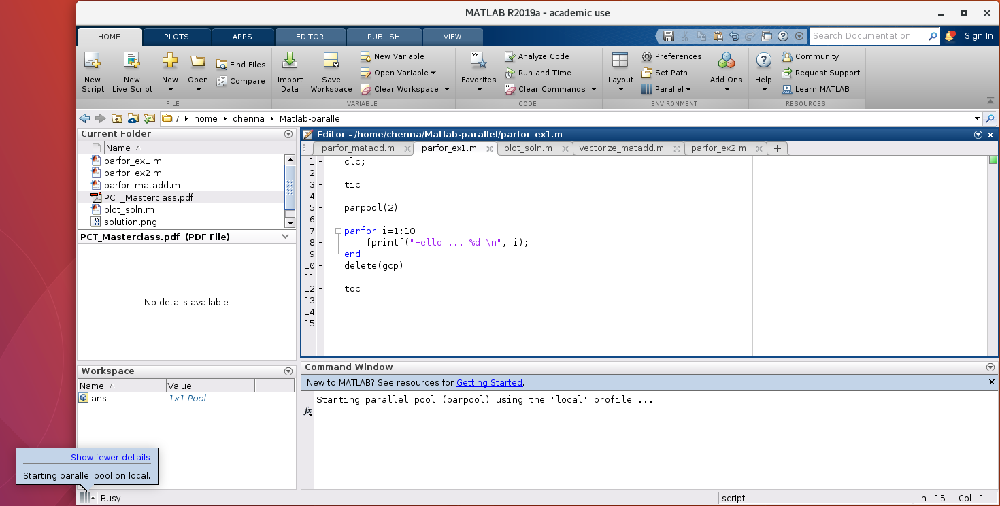

# Parallel Computing support in MATLAB

>## What does [MATLAB](https://uk.mathworks.com/products/parallel-computing/parallel-support.html) say?
>A growing number of functions, System objects™, and features 
in several MATLAB® and Simulink® products offer the ability to 
take advantage of parallel computing resources without 
requiring any extra coding. We can enable this support by 
simply setting a flag or preference. To take advantage of this 
functionality on our desktop, we need **Parallel Computing Toolbox™**. 
To scale the parallel computing support to larger resources 
such as computer clusters, we also need **MATLAB Parallel Server™**.
{: .callout}

### MATLAB Parallel Computing Toolbox (PCT)
* The MATLAB Parallel Computing Toolbox supports you in 
  parallelising your MATLAB code to take the advantage 
  of multiple CPU and GPUs.
* MATLAB's high-level constructs such as parallel for-loop, 
  parallel function evaluators, distributed arrays, and 
  parallelised numerical algorithms for linear algebra and 
  differential equations help you harness the power of 
  supercomputers by using the same code on both the your
  personal computer and supercomputer. (Still requires some
  effort, though. Remember, there are no free lunches).

#### MATLAB Parallel Computing Toolbox terminology
Throughout this course, we will using several terms related to
the MATLAB Parallel Computing Toolbox. Some important terms in 
MATLAB Parallel Computing Toolbox that we use and learn in this 
course are:

:-----------------|:-----------------------------------------
* **Cluster**     | The (remote) high-performance computing machine.
* **Client**      | The head MATLAB session; it creates workers, distributes work and gathers results. 
* **Worker**      | A single computing unit, typically a CPU core on HPC machines.
* **Interactive** | The mode of working using the desktop environment (GUI).
* **Batch-style** | The mode of working using scripts, without the GUI.
* **parpool**     | Short for parallel pool. Refers to a group of workers. A parallel pool can be either local or remote.
* **gcp**         | Short for "Get the Current Pool" Returns a `paralleli.Pool` object.
* **labindex**    | Rank of the worker in the active parallel pool. `Starts from 1`.
* **numlabs**     | Total number of workers in the active parallel pool.
* **spmd**        | Short for the parallel programing construct *Single Program Multiple Data*.
* **parfor**      | Parallel for-loop.
* **parfeval**    | Parallel function evaluator.
* **pmode**       | Interactive Command Window for Parallel Computing.
* **mpiprofile**  | MATLAB's profiler for parallel code.

### MATLAB Parallel Server
* All the aspects of licensing on the cluster-side are 
  handled by MATLAB Parallel Server which was known in the past as
  MATLAB Distributed Computing Server (MDCS).
* MATLAB Parallel Server offloads our MATLAB jobs to 
  HPC machines to take advantage of multiple CPU and GPUs. As depicted
  in the image below.
* It supports batch jobs, interactive parallel computations 
  and distributed computations with large matrices.

|  |
|:--:|
| Image credit: <https://www.cac.cornell.edu/wiki/index.php?title=Tutorial:_Using_MATLAB_PCT_and_MDCS_in_Red_Cloud> |

> ## MATLAB's job Scheduler
> * MATLAB PCT comes with an in-built job scheduler 
which can be used to distribute and manage parallel jobs 
among the workers in a parallel pool. However, we don't 
know how this interacts with the HPC cluster, especially 
when used in combination with the HPC cluster's job schedulers
such as SLURM which is used on Supercomputing Wales (SCW) clusters.
> * Therefore, use of MATLAB's job scheduler `is not 
recommended` for use on SCW clusters.
{: .callout}

## parpool
**parpool** function starts a parallel pool of workers 
(also called as labs) to run the job. The basic syntax 
for using **parpool** is

~~~
parpool(2)
%
% some parallel tasks here
%
delete(gcp)
~~~
{: .language-matlab}

The above code starts a parallel pool with two workers, 
performs some parallel tasks, if any, and deletes the instance
of the currently active parallel. The function call `delete(gcp)`
shuts down the parallel pool before deleting the parallel pool object.

By default, the parallel pool is created using the "local" profile,
meaning that `parpool(2)` is the same as `parpool('local', 2)`.

A parallel pool with other profiles and with different number of 
workers can be initialised by using
~~~
parpool('myProfile', 10)
~~~
{: .language-matlab}

We can also start a parallel pool with the workers on a 
remote cluster by using
~~~
clus = parcluster;
parpool(clus)
~~~
{: .language-matlab}

If we are running MATLAB in the interactive mode, 
then we can change the parallel pool option accessing `Parallel` icon
in the `Home` tab.

Once the job has started, we can check the parallel pool status by
clicking on the pool status indicator at the lower-left corner of 
the MATLAB desktop window.

## What happens when we execute the **parpool** command?
To understand what happens when we use the **parpool** command, 
let us run following code.

~~~
parpool(2)

parfor i=1:6
   fprintf("Hello ... %d \n", i)
end

delete(gcp)
~~~
{: .language-matlab}

~~~
Starting parallel pool (parpool) using the 'local' profile ...
Connected to the parallel pool (number of workers: 2).

ans =

 Pool with parameters:

           Connected: true
          NumWorkers: 2
             Cluster: lolcal
       AttachedFiles: {}
   AutoAddClientPath: true
         IdleTimeout: 30 minutes (30 minutes remining)
         SpmdEnabled: true

Hello ... 1
Hello ... 3
Hello ... 5
Hello ... 2
Hello ... 4
Hello ... 6

Parallel pool using the 'local' profile is shutting down.
~~~
{: .output}

When the parpool is executed, MATLAB PCT starts a parallel pool
with the specified profile and number of workers. We can see this information
in the output screen.

>## parpool - some caveats
>* MATLAB allows only one instance of active parallel pool at any given time. 
If we want to change the profile or the number of workers or both, 
then we have to shutdown the existing parallel pool first using `delete(gcp)`.
>* MATLAB takes some time to start a parllel pool. So, the first run
using a parallel tool/function is always slower because of the overhead 
in starting the parallel pool. The overhead can be significant when 
running multiple jobs.
>* We can check if a parallel pool is active using `gcp('nocreate')`.
>* The number of workers requested should not be more than that 
specified in the profile preferences. If we request more workers than 
those specified in the profile, then MATLAB throws an error.
{: .callout}

> ## matlabpool
> You may come across `matlabpool` if you browse internet for MATLAB PCT.
> `matlabpool` is the name used before R2013b. From R2013b onwards,
> `matlabpool` has been replaced with `parpool`.
{: .callout}

> ## Exercise on **parpool**
> Execute `gcp` on the command line to understand its behaviour 
> with different options. Experiment with
> * p=gcp
> * delete(p)
> * p=gcp('nocreate')
> * isempty(p)
{: .challenge}

## parfor Vs spmd
**parfor** and **spmd** are the two of the most important 
constructs in the MATLAB PCT. You will learn them in the later part
of this course. Before delving into the details of **parfor** and
**spmd**, let's have a brief overview of them. 
* As the name suggests **parfor** is the parallel for-loop.
   * **parfor** distributes the loop iterations among the workers.
* **spmd** refers to **s**ingle **p**rogram **m**ultiple **d**ata 
  construct in the esotric language of parallel computing.
   * **spmd** is a parallel region and offers a much more flexibility 
     in writing parallel codes.
   * The statement(s) inside the **spmd** construct are executed
     on all the workers.
* The fundamental difference between **spmd** and **parfor** is the
  communication between the workers in the pool. While **spmd** allows 
  clear way of communication between the workers, communication 
  in **parfor** is a mystery.

To understand the differences between **parfor** and **spmd**, 
let us do the following excercise.

> ## Exercise on **parfor** and **spmd**
> ~~~
> clc;
> parpool(2);
> parfor i=1:6
>    t = getCurrentTask();
>    fprintf("Hello ... %d \n", t.ID)
> end
> 
> spmd
>    fprintf("Hello ... %d \n", labindex)
> end
> ~~~
> {: .language-matlab}
{: .challenge}


