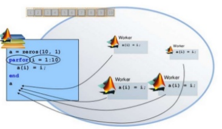

## parfor
**parfor**-loop is the parallel version of the **for**-loop in
MATLAB. In a parfor-loop, the MATLAB parallel server:
* issues the `parfor` command,
* distributes the loop iterations to workers in the parallel pool,
* sends the data to the workers to execute the command,
* collects the data from the workers once the workers successfully finish the computations, and,
* assembles the data received from the workers.

||
|:--:|
|Image credit: <https://www.slideshare.net/jbhuang/writing-fast-matlab-code>|

To understand `parfor` and assess the performance gains,
we use the example of the eigenvalue problem. We compute the maximum
of the magnitude of eigenvalues of $m$ random matices of size $n\times n$.
The MATLAB code using a standard serial for-loop is shown below:

~~~
clear all;
clc;

m = 50;
n = 500;
a = zeros(m);

tic
for i=1:m
    a(i) = max(abs(eig(rand(n))));
end
toc
~~~
{: .language-matlab}

~~~
Elapsed time is 6.783651 seconds.
~~~
{: .output}

The following MATLAB code extends the previous code to using `parfor`:
~~~
clear all;
clc;

m = 50;
n = 500;
a = zeros(m);

% serial run
%%%%%%%%%%%%

tic
for i=1:m
    a(i) = max(abs(eig(rand(n))));
end
toc

% parallel run
%%%%%%%%%%%%%%

tic
ticBytes(gcp)
parfor i=1:m
    a(i) = max(abs(eig(rand(n))));
end
tocBytes(gcp)
toc
~~~
{: .language-matlab}

~~~
Elapsed time is 6.824506 seconds.
Starting a parallel pool (parpool) using the 'local' profile ...
Connected to the parallel pool (number of workers: 2).
 #    BytesSentToWorkers       BytesReceivedFromWorkers
=======================================================
 1       17928                      12376
 2       17928                      12376
 Total   35856                      24752

Elapsed time is 19.606094 seconds.
~~~
{: .output}

The elapsed time for the parfor-loop is significantly higher than the for-loop.
This is because of an overhead incurred in starting the parallel pool for the first time.
If we run the code for the second time, the elapsed time for the parfor-loop should be lower.

~~~
Elapsed time is 6.792368 seconds.
Starting a parallel pool (parpool) using the 'local' profile ...
Connected to the parallel pool (number of workers: 2).
 #    BytesSentToWorkers       BytesReceivedFromWorkers
=======================================================
 1       20064                      14456
 2       15792                      10296
 Total   35856                      24752

Elapsed time is 3.893476 seconds.
~~~
{: .output}

> ## Data transfer
> Note that the number of bytes sent to and received from workers need not always be equal between the workers.
{: .callout}

> ## Exercise on **parfor**
> The following code populates a 2D array of size `n`$\times$`n`, and
> computes the sum in each row on the fly:
> ~~~
> clc;
> tic
> n = 5;
> A = zeros(n,n);
>
> % serial loop
> for i=1:n
>    for j=1:n
>        A(i,j) = 2*i+3*j;
>    end
>    row_sum = sum(A(i,:));
>    fprintf("%d \t %d \n", i, row_sum)
> end
> toc
> ~~~
> {: .language-matlab}
> We thought of speeding up the calculations by using **parfor**.
> So, we create the following code using **parfor**:
> ~~~
> tic
> A = zeros(n,n);
>
> % parallel loop
> parfor i=1:n
>    for j=1:n
>        A(i,j) = 2*i+3*j;
>    end
>    row_sum = sum(A(i,:));
>    fprintf("%d \t %d \n", i, row_sum)
> end
> toc
> ~~~
> {: .language-matlab}
> When we run the program, we will find out that the
> serial code works but the parallel code does not.
> MATLAB throws an error about `parfor slicing`.
>
>
> Fix the code.
>
> > ## Solution
> > It turns out that we cannot use the array anywhere else in
> > the parfor-loop if we already have used it in a nested for-loop
> > inside the parfor-loop.
> >
> >
> > To fix this, we need to create a temporary 1D array as shown below:
> > ~~~
> > parfor i=1:n
> >    atemp = zeros(1,n);
> >    for j=1:n
> >        atemp(j) = 2*i+3*j;
> >    end
> >    A(i,:) = atemp;
> >    row_sum = sum(A(i,:));
> >    fprintf("%d \t %d \n", i, row_sum)
> > end
> > ~~~
> > {: .language-matlab}
> {: .solution}
{: .challenge}

> ## Array slicing
> Array slicing in MATLAB is nothing but array indexing in MATLAB.
{: .callout}

## When to use parfor
* When the iterations are independent of each other,
  for example, vector and matrix additions.
* When each iteration takes a longer time (this is relative
  and context-dependent) to execute on a single processor.
* In general, loop iterations with computationally intensive
  executions are the candidates for using a parfor-loop, for example,
  the example of computing maximum eigenvalue at the beginning of this episode.

## When not to use parfor
* We might not gain the computational benefits using parfor-loop if:
    * the loop iterations takes a short time to execute, and,
    * the code has already been vectorised.
* Data dependencies.
  ~~~
  a = 1:100;
  parfor i=2:100
      a(i) = 2.0*a(i-1);
  end
  ~~~
  {: .language-matlab}
  The latest version (2019a) of MATLAB throws an error for this loop, anyway.

> ## parfor-loop index
> parfor-loop indices must be consecutive integers:
> ~~~
> parfor i = 1 : 20        % valid
> parfor i = -10 : 10      % valid
> parfor i = 1 : 3 : 100   % not valid
> ~~~
> {: .language-matlab}
{: .callout}


