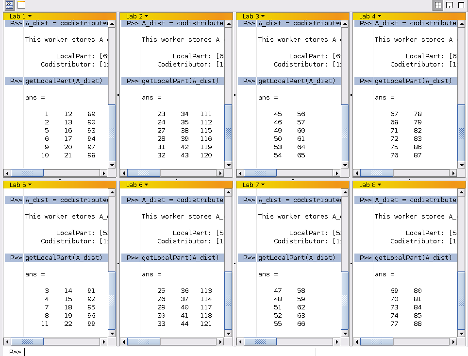
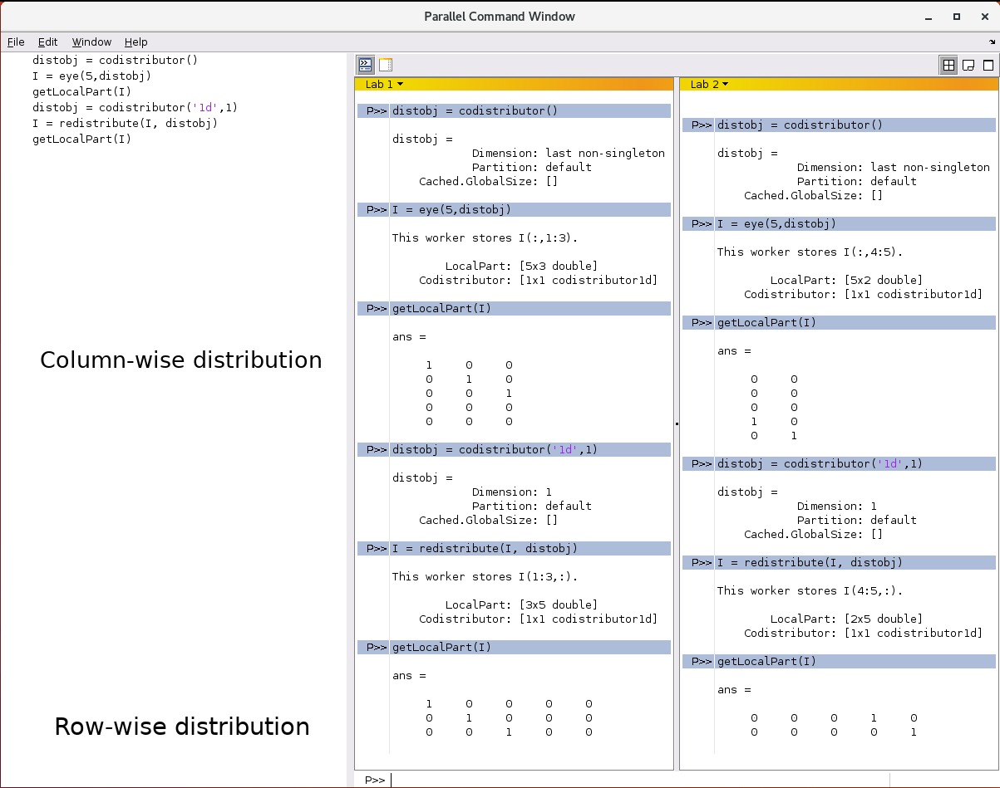

## spmd
* **spmd** stands for **s**ingle **p**rogram **m**ultiple **d**ata.
SPMD, in the parallel computing paradigm, usually refers to a parallel program
written for distributed-memory architectures using the Message-Passing Inteface (MPI).
* **s**ingle **p**rogram refers to the fact that the statements inside
  the block execute on all the workers in the active parallel loop.
* **m**ultiple **d**ata aspect refers to the ability of the workers (labs) to work
  on a different data set while executing the same code.

The basic syntax for **smpd** programs in MATLAB is:
~~~
% execution on master/client
spmd (n)
    % execution on workers
    statements
end
% execution on master/client
~~~
{: .language-matlab}

In the above code, `(n)` is optional. If this is not specified,
then the **spmd** uses all the workers in the pool, by default.
We can change this behaviour by explicitly specifying the
number of workers, if necessary.

## When to use **spmd**?
**spmd** is the most flexible parallel programming construct in
MATLAB PCT, and is very useful for:
* programs that take a long time to execute on local computers, and,
* programs that operate on large data sets which do not fit
  on local computers.

### Where is the data?
* If a variable created before the **spmd** block is used inside
the block, then that variable will be copied to all the workers
participating in the parallel pool corresponding to that **spmd** block.
* A variable created inside the **spmd** block is unique to each worker.

### Understanding **spmd**
To understand how **spmd** in MATLAB works, let's create a
MATLAB script with the following code and run it:
~~~
A = eye(5,5);

spmd
    Adist = codistributed(A);
    getLocalPart(Adist)

    if(labindex == 1)
      B = magic(3);
    else
      B = magic(5);
    end
end

B

B{1}

B{2}
~~~
{: .language-matlab}

When the program is run successfully (with a parallel pool
with 2 workers), we get the following output:
~~~
Lab 1:

  ans =
    1    0    0
    0    1    0
    0    0    1
    0    0    0
    0    0    0

Lab 2:

  ans =
    0    0
    0    0
    0    0
    1    0
    0    1

B =
    Lab 1: class = double, size = [3 3]
    Lab 2: class = double, size = [5 5]

  ans =
    8    1    6
    3    5    7
    4    9    2

  ans =
    17    24    1    8    15
    23     5    7   14    16
     4     6   13   20    22
    10    12   19   21     3
    11    18   25    2     9
~~~
{: .output}

The above program:
* creates matrix `A` as a 5x5 identity matrix on the client/master.
* then opens an **spmd** block.
* creates a distributed array `Adist` by copying the contents of `A`.
* gets the local part of `Adist` and prints it to the screen.
* creates a local variable `B`.
* ends the **spmd** block.
* prints the contents of `B`.
* prints the contents of `B{1}`.
* prints the contents of `B{2}`.

In the above program:
* `A` is an array variable that is local to the client/master.
* `Adist` is the distributed array, meaning that the contents of
  `Adist` are stored among the workers. Each worker stores only
  a portion of `Adist`.
* array variable `B` is local to each worker in the parallel pool.
  In the strict sense of parallel programming, accessing of `B`
  using `B{1}` and `B{2}` is *illegal* because it is created
  inside the **spmd** block. But, MATLAB allows this. In MATLAB `B`
  is called as a *composite* variable.
* `labindex` is the rank of the worker.

## Variable persistence in sequences of **spmd** constructs
~~~
% first spmd block
spmd
    if(labindex == 1)
      B = magic(3);
    else
      B = magic(5);
    end
end

B

B{1}

B{2}

% delete(gcp)

% second spmd block
spmd
    B = B + 2*labindex;
end

B

B{1}

B{2}
~~~
{: .language-matlab}

When the program is run successfully (with a parallel pool
with 2 workers), we get the following output:
~~~
B =
    Lab 1: class = double, size = [3 3]
    Lab 2: class = double, size = [5 5]

ans =
    8    1    6
    3    5    7
    4    9    2

ans =
    17    24    1    8    15
    23     5    7   14    16
     4     6   13   20    22
    10    12   19   21     3
    11    18   25    2     9
B =
    Lab 1: class = double, size = [3 3]
    Lab 2: class = double, size = [5 5]

ans =
   10    3    8
    6    7    9
    8   11    4

ans =
    21    28    5   12    19
    27     9   11   18    20
     8    10   17   24    26
    14    16   23   25     7
    15    22   29    6    13
~~~
{: .output}

> ## Multiple **spmd** constructs
> Uncomment the `delete(gcp)` line in the above code and
> observe the output behaviour.
> > ## Solution
> > MATLAB throws an error when it reaches the second **spmd** block.
> > This is because all the variables on the workers (labs) will be
> > deleted from memory once the parallel pool is deleted.
> {: .solution}
{: .challenge}

## Explicit data transfer
In a parallel program, we are often required to transfer data between
the workers. Here are some examples of this:
* To get the interface fluxes from the neighbouring element in finite element analysis;
* In evaluating stencils/operators in finite difference schemes;
* For some averaging operations for pixels in image processing;
* Et cetera.

The **spmd** construct offers a flexible environment for explicit data
transfer between the workers. MATLAB PCT provides its own functions that
are equivalent to `MPI_Send`, `MPI_Receive`, `MPI_SendReceive`, `MPI_Barrier`,
`MPI_Broadcast`, and others in the MPI paradigm. The MATLAB equivalent of these functions
are `labSend`, `labReceive`, `labSendReceive`, `labBarrier` and `labBroadcast`.

### Syntax and usage for `labSend`
~~~
% labSend(data, rcvLabIdx, tag)  --- `tag` is optional

% consider that this code is executed on lab 1

a = [1 2 3 5 7 11];

labSend(a, 5)           % sends array `a` to the worker 5

labSend(a, [2 4 8 10])  % sends array `a` to the workers 2, 4, 8 and 10.

labSend(a, 3, 1234)     % sends array `a` and a tag value 1234 to the worker 3.
~~~
{: .language-matlab}

> ## `labSend`
> * `data` can be any supported MATLAB data type.
> * `rcvLabIdx` must be a positive integer, or vector integers between 1 and *numlabs*.
> * `tag` must be a nonnegative integer from 0 to 32767. Default value is 0.
{: .callout}

### Syntax and usage for `labReceive`
~~~
%data = labReceive                 % receives data from any worker with any tag.
%data = labReceive(srcWkrIdx)      % receives data from the specified worker with any tag
%data = labReceive('any',tag)      % receives data from any worker with the specified tag.
%data = labReceive(srcWkrIdx,tag)  % receives data from only the specified worker with the specified tag.
%[data,srcWkrIdx,tag] = labReceive % returns the source worker labindex and tag with the data.

a = labReceive(1, 1234)            % receives the data from lab 1 that matches the tag 1234.
~~~
{: .language-matlab}

> ## Blocking communication
> The `labSend` function can block the execution until the
corresponding `labReceive` function is executed in the receiving lab.
This can lead to communication blockage between the workers, which makes this
program hang forever.
{: .callout}

> ## Exercise on communication
> Create a new parallel pool with 4 workers.
>
> Create a 1D array of size 10 on lab 1.
>
> Send it to all labs in the pool using tag 9876.
>
> From all the labs except lab 1:
>
> \*) Print a message along with the lab number
>
> \*) Print the contents of array
>
> \*) Add labindex to the array
>
> \*) Print the contents of array again
>
> > ## Solution
> > ~~~
> > clc;
> > delete(gcp('nocreate'));
> > parpool(4);
> > spmd
> >     if(labindex == 1)
> >         a = 1:10;
> >         labSend(a, 2:numlabs, 9876);
> >     else
> >         a = labReceive;
> >         fprintf("Hello from worker %d \n", labindex);
> >         disp(a);
> >         a = a + labindex;
> >         disp(a);
> >     end
> > end
> > ~~~
> > {: .language-matlab}
> {: .solution}
{: .challenge}

### `pmode` and Parallel Command Window
In the previous examples, we have observed that the output
from all the workers is displayed in the default MATLAB Command
Window. This is because the workers in the default MATLAB
session are without their individual displays. While this might
not be such a big issue for problems with small data sets,
it can be a daunting task to navigate our way through the entire
output from all the workers. MATLAB PCT offers a very useful
functionality in the form of MATLAB's Parallel Command Window
that helps to overcome this difficulty.

The MATLAB's Parallel Command Window is similar to the standard
Command Window of MATLAB where we type the commands. However,
unlike the standard Command Window, the Parallel Command Window
runs on all the workers in the parallel pool. The following figure
shows MATLAB's Parallel Command Window with eight workers (labs):

> ## `pmode` and  MATLAB's Parallel Command Window
> `pmode` is the MATLAB command for launching the MATLAB Command
> Window in parallel mode. `pmode` is interactive.
> `pmode` lets us work interactively with a job running simultaneously
> on several workers in the parallel pool. The commands we type at the
> `pmode` command prompt are executed on all the workers. Commands to
> start and exit the `pmode` are:
> ~~~
> >> pmode start                         % start pmode with the default options
> >> pmode start <numworkers>            % start pmode with the specified number of workers
> >> pmode start <profile> <numworkers>  % start pmode with the specified profile and number of workers
> >> pmode quit                          % stop the pmode job (deletes the job and closes Parallel Command Window)
> >> pmode exit                          % stop the pmode job (deletes the job and closes Parallel Command Window)
> ~~~
> {: .language-matlab}
{: .callout}

> ## `pmode` command prompt
> * The command prompt in the standard mode is: `>>`
> * The command prompt in `pmode` is: `P>>`
{: .callout}

> ## Exercise on Parallel Command Window
> Semicolons are not included in the code so that we can see the
> information on the different variables we create.
> * Open the Parallel Command Window with two workers:
>     ~~~
>     >> pmode start local 2
>     ~~~
>     {: .language-matlab}
> * Create a distributed identity matrix of rank 5:
>     ~~~
>     P>> distobj = codistributor()
>     P>> I = eye(5, distobj)
>     P>> getLocalPart(I)
>     ~~~
>     {: .language-matlab}
>     You should see the first three `columns` displayed in the output window
>     of `Lab 1` and the next two `colulmns` in `Lab 2`.
> * Rearrange the distribution based on rows:
>     ~~~
>     P>> distobj = codistributor('1d',1)
>     P>> I = redistribute(I, distobj)
>     ~~~
>     {: .language-matlab}
>     Now, you should see the first three `rows` displayed in the output window
>     of `Lab 1` and the next two `rows` in `Lab 2`:
{: .challenge}

## Distributed data
One of the fundamental ideas of parallel computing is to distribute
the data among the computing units so that we can store and process
significantly large amount of data, (and in short time too). The skill
in developing programs for parallel computing is in understanding how
the data is stored, and in managing the data efficiently. In MATLAB,
distributed arrays can be created using several options.

A distributed array can be created from the existing array on
the client/master. For example:
~~~
A = eye(5,5);  % array on the client/master
spmd
    Adist = codistributed(A);  % array distributed among the workers
end
~~~
{: .language-matlab}

A distributed array can also be created by using array constructors, as seen
in the previous example. To create a distributed array of size $5\times5$ and
initialise to zero:
~~~
spmd
    Adist = zeros(5, 5, 'codistributed');  % array distributed among the workers
end
~~~
{: .language-matlab}

As seen in the previous examples, the default distribution strategy is 
the distribution by columns. This behaviour can be changed by passing
a distributor object with appropriate options to the **codistributed**
function, or using the **redistribution** function:

~~~
A = eye(5,5);  % array on the client/master
spmd
    % codistribution object with the options to distribute
    % the array using 1d (one-dimensional) distribution
    % in dimension 1 (rows)
    distobj = codistributor('1d', 1);

    Adist = codistributed(A, distobj);  % array distributed among the workers
end
~~~
{: .language-matlab}

~~~
A = eye(5,5);  % array on the client/master
spmd
    % default distribution using column-wise distribution
    Adist = codistributed(A);  % array distributed among the workers

    % codistribution object with the options to distribute
    % the array using 1d (one-dimensional) distribution
    % in dimension 1 (rows)
    distobj = codistributor('1d', 1);

    % redistributed array using row-wise distribution
    Adist = redistribute(Adist, distobj);
end
~~~
{: .language-matlab}

## distributed vs codistributed arrays
So far we have seen the use of the **codistributed** function for creating
distributed arrays in MATLAB PCT. MATLAB offers another function
**distributed** which works in a similar fashion but with a slight difference.

**distributed** and **codistributed** are the data type of the arrays distributed
in the parallel pool - the data type is **distributed** on the client and
**codistributed** on the workers.

The main difference between **distributed** and **codistributed** functions
is in the amount of flexibility in controlling the distribution pattern.
* **distributed**:
  * Should be used outside the `spmd` block.
  * Is called from the client/master, and it creates an array
    that is distributed among all the workers in the parallel pool.
  * We *cannot* control the distribution details when using this function.
  * Use **distributed** to create a distributed array by copying
    the data on the client workspace or a datastore, using the default
    distribution pattern.
* **codistributed**
  * When used in an `spmd` block or in **pmode**, **codistributed**
    creates an array that is distributed among the workers in the
    parallel pool. But when used outside an `spmd` block, the entire
    content of the array is stored on the client.
  * Is called by all the workers in the pool, and it creates an array
    that is distributed among all the workers in the parallel pool.
  * We CAN control the distribution details when using this function,
    for example, row-wise distribution or block distribution instead of
    the default column-wise distribution.
  * Use **codistributed** to create a distributed array by copying
    the data on the client workspace or a datastore, using either the default
    distribution pattern or a distribution pattern of our liking.

> ## **distributed** inside `spmd` or **pmode**
> **distributed** inside `spmd` block creates a variable
  of class `spmdlang.InvalidRemote`. **Never** use **distributed**
  inside the `spmd` block or in **pmode**.
{: .callout}

> ## Exercise on distributed arrays
> Run the following code from a script (not in pmode), and
> observe the output:
> ~~~
> A = eye(5,5);  % array on the client/master
>
> Adist1 = distributed(A)  % distributed array
> Adist3 = codistributed(A)  % distributed array
> spmd
>     Adist2 = codistributed(A);  % distributed array
> end
>
> disp("Adist1 - Adist2")
> Adist1 - Adist2
> disp("Adist1 - Adist3")
> Adist1 - Adist3
> ~~~
> {: .language-matlab}
>
> > ## Solution
> > `Adist1` and `Adist2` are distributed arrays distributed among the workers.
> > `Adist3` is created as a distributed array but all of its contents are
stored only on the client.
> > Operation `Adist1 - Adist2` works fine. But MATLAB throws an error
`"It is illegal to mix distributed and codistributed arrays in an opeeration."`
when it tries to executre `Adist1 - Adist3`.
> {: .solution}
{: .challenge}

> ## Exercise - Parallel direct solver
> In this exercise, we use the parallel direct solver, the `\` operator,
> in MATLAB PCT to solve a matrix system.
> ~~~
> clc;
> 
> n = 1000;
> A = randi(100,n,n);
> ADist = distributed(A);
> 
> b = sum(A,2);
> bDist = sum(ADist,2);
> 
> xEx = ones(n,1);
> xDistEx = ones(n,1,'distributed');
> 
> tic
> x = A\b;
> err = norm(xEx-x)
> toc
> 
> tic
> xDist = ADist\bDist;
> errDist = norm(xDistEx-xDist)
> toc
> ~~~
> {: .language-matlab}
{: .challenge}

## Gathering data
Until now, we have looked at techniques for distributing the data among
the workers in a parallel pool. Often, we need to gather from all
the workers, for example, for plotting. MATLAB PCT provides a function
`gather` for this purpose.

The output of `gather` varies depending upon where it is called in the code.
* Inside the **spmd** block, `gather` gathers all the elements of an array
from all the workers and dumps the entire collection to all the workers. This
is equivalent to `MPI_Allgather` in the MPI. This is the default behaviour if
no second argument is specified.
* Inside the **spmd** block, `gather` gathers all the elements of an array
from all the workers and dumps the entire collection to a particular worker,
if a second argument is specified.  `B=gather(A,labnum)` gathers all the
elements of `A` from all the workers onto the worker `labnum`.
* Outside the **spmd** block, `gather` gathers all the elements to the client
workspace.

`gather` with codistributed arrays:
~~~
n = 20;
spmd
    A = codistributed(magic(n));  % a codistributed array on all workers
    B = gather(A);                % gathers all elements to all workers
    C = gather(A,2);              % gathers all elements to worker 2
end
D = gather(A);                    % gathers all elements to the client
~~~
{: .language-matlab}

`gather` with distributed arrays.
~~~
n = 20;
A = distributed(magic(n));  % a distributed array on all workers
B = gather(A);              % returns the array to the client
~~~
{: .language-matlab}


