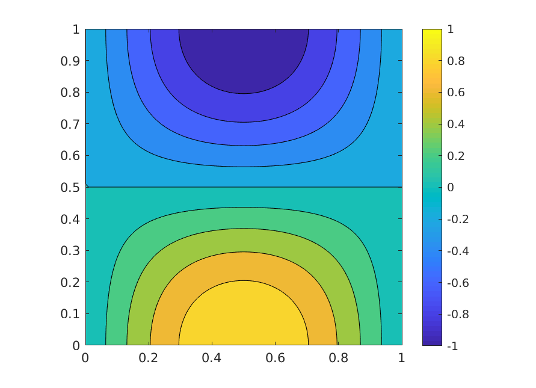
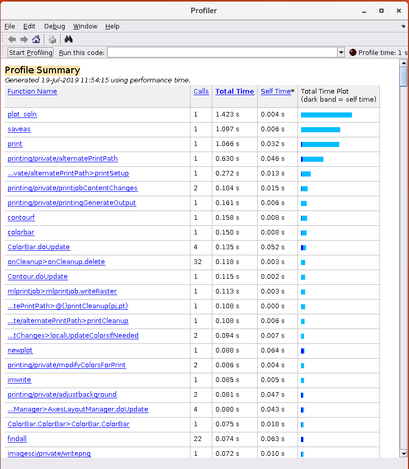
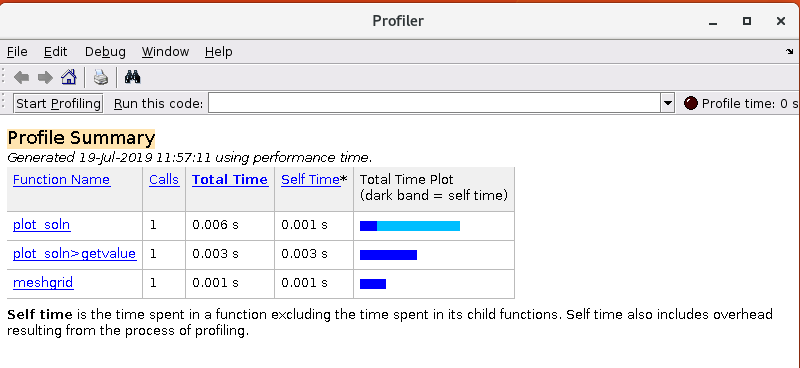
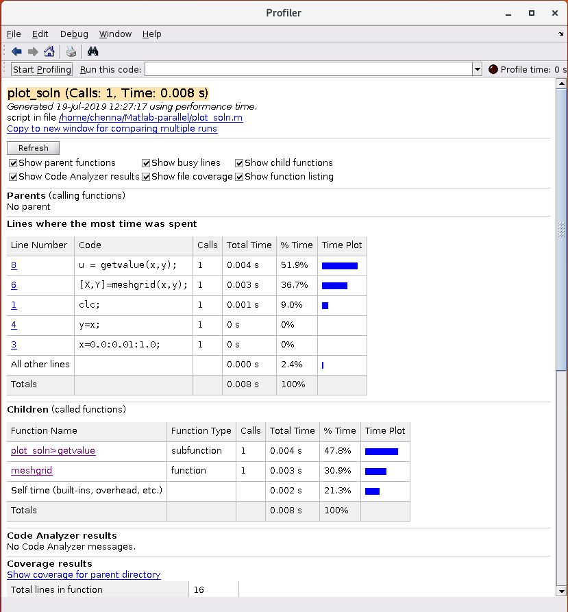
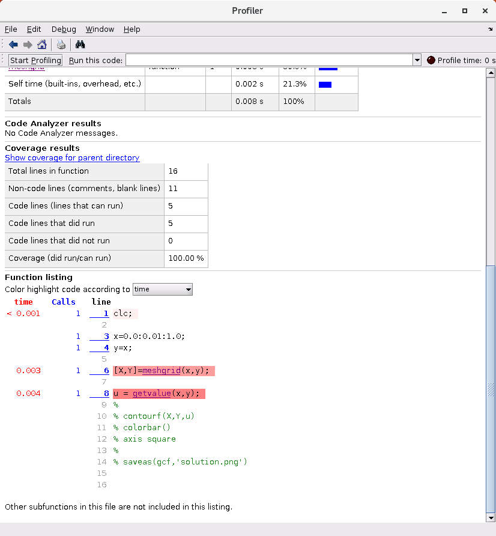

## Profiling
Profiling (software profiling) is the process of analysing the performance
of a program
by measuring the memory and time complexity of the program, for example,
number of floating point operations (FLOPs),
number of functions calls, duration of a function call,
memory allocations and deallocations inside a function, etc. We can profile
the binary (executable) or the source code depending upon the reasons behind
profiling. There are various types of profilers depending upon the techniques
they use. Various techniques used by profilers are: event-based,
statistical samping, instrumentation-based and simulation-based.

So, profilers provide us with some very important information
about the performance of a program. We can use this data to identify
the critical regions in the code, for example:
* A for loop that is taking 90% of the runtime,
* A function or a for-loop that may be quick but performs a lot of
  memory allocations and deallocations,
* A dead-lock in communication (for parallel programs), and,
* Functions with significant communication over computing
  (for parallel programs)

### When to profile?
* Profiling might not be necessary, if the program requires only a few
seconds to run and/or if we are not interested in executing the program
a significant number of times. However, we can still profile the program
to understand its functional behaviour.
* Since profilers provide us with the performance data, profiling is
  the first step in improving the performance of our code.

## MATLAB Profiler
Profiling can be a time consuming process, often requiring the knowledge
of specialist profiling tools, especially when using C++ and Fortran. However,
MATLAB provides a built-in profiler called `profile` that is easy-to-use.
The results from `profile` can be accessed either by calling the  `profile`
function or by using the MATLAB's user interface, **Profiler**.

## Hands-on with MATLAB Profiler
~~~
clc;

x=0.0:0.01:1.0;
y=x;

[X,Y]=meshgrid(x,y);

u = getvalue(x,y);

contourf(X,Y,u)
colorbar()
axis square

saveas(gcf,'solution.png')

function u = getvalue(x,y)
    N = max(size(x));
    u = zeros(N,N);

    for i=1:N
        for j=1:N
            u(i,j) = cos(pi*x(i))*sin(pi*y(j));
        end
    end
end
~~~
{: .language-matlab}

Once we press the **Run and Time** button we get the contour plot of the
solution and a second window showing the 'Profile Summary'.
The profile summary contains five columns:
* Column 1: Function Name.
* Column 2: Calls - number of calls made to the function in column 1.
* Column 3: Total Time - total time spent inside a function.
* Column 4: Self Time - amount of time spent in a function, excluding the time spent in the child functions.
* Column 5: Total Time Plot - a bar plot showing the Total and Self times.

From the profile summary we can identify the parts of the code
that are taking more time to execute. For this example, most of
the time is spent in creating the figure and saving it.
The amount of time spent in the user function `getvalue` is somewhere down the list.

To get the amount of time spent in our function `getvalue`, we can comment out the calls to the figure and re-run the Profiler.
~~~
clc;

x=0.0:0.01:1.0;
y=x;

[X,Y]=meshgrid(x,y);

u = getvalue(x,y);

% contourf(X,Y,u)
% colorbar()
% axis square
%
% saveas(gcf,'solution.png')

function u = getvalue(x,y)
    N = max(size(x));
    u = zeros(N,N);

    for i=1:N
        for j=1:N
            u(i,j) = cos(pi*x(i))*sin(pi*y(j));
        end
    end
end
~~~
{: .language-matlab}

Now, the amount of time spent in our function `getvalue` is quite apparent. We can also get the profile data for the code inside the function by clicking the function name in Column 1.

In this way, we can identify the amount of time spent in various parts of the code, and then take necessary actions depending upon how critical or not a block of code or specific function is.

## Using **profile** from the command prompt
We can also use the profiler from the command prompt. The following snippet
shows a typical usage example of the MATLAB profiler from the
command prompt:

~~~
>> profile on       % starts the profiler
>> n = 10;          
>> A = rand(n);
>> ev = eig(A);
>> profile viewer   % opens the profile viewer
>> profsave         % saves the profile statistics to
>> profile stop     % stops the profiler
>> profile clear    % clears the recorded statistics
~~~
{: .language-matlab}

## Using **profile** in the script
Profiling the entire code by clicking the button on the command
window may be fine for simple programs, or when you are profiling the
entire code. But, many times profiling the entire code is not necessary,
for example, when you are fine tuning the performance of a block of code
or a specific function. In such cases, we can use profile from the script
and save the profile data for inspection, once the program is executed:

~~~
clc;

n = 5;

profile on;

a = rand(n)
b = mySquare(a)

myProfInfo = profile('info');

% Specify the directory to save the profile results as the second argument.
% The default directory is 'profile_results'
profsave(myProfInfo, 'myprofile_info');
profile off;
profile clear;

function b = mySquare(a)
    b = a.*a;
end
~~~
{: .language-matlab}

> ## HTML browser
> When we call the `profsave` function, it saves the profiling data in HTML files
  and opens then in a browser for visualisation. There is no option to prevent
  this from happening. A workaround for this is to save the results to a file
  and load it at a later point, as shown below:
>
> **Step 1:** Save the profiling data to a *.mat* file.
> ~~~
> myProfInfo = profile('info');
> save('myProfInfo.mat', 'myProfInfo');
> ~~~
> {: .language-matlab}
> **Step 2:** Once the program is executed, we can load the *myProfInfo.mat* file and use
  the `profsave` function to visualise the profiler statistics.
>
> ~~~
> >> load('myProfInfo.mat');
> >> profsave(myProfInfo, 'myprofile_info')
> ~~~
> {: .language-matlab}
{: .callout}


