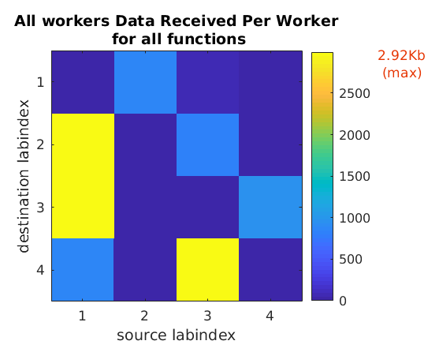
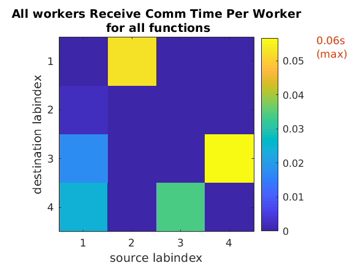
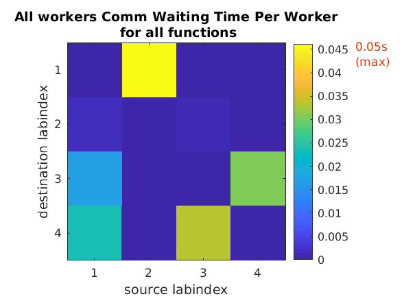
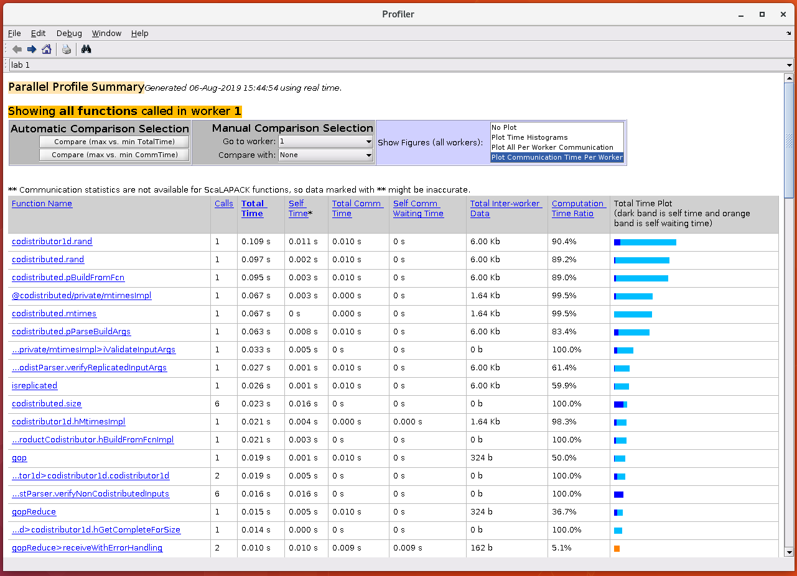
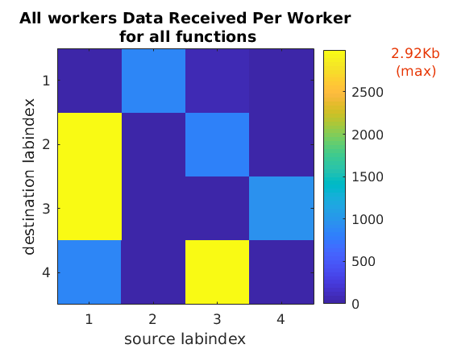
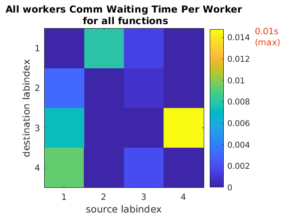

## Profiling the parallel code - `mpiprofile`
Profiling parallel code in MATLAB is similar to profiling
serial code. For profiling parallel code, we have to use the
`mpiprofile` command. The difference between using the standard
`profile` and `mpiprofile` commands is in where they are called.

Similar to the serial profiler, `mpiprofile` can be used from
either the command prompt (`pmode`) or within the MATLAB script.
For interactive usage, `mpiprofile` should be called from the
parallel command window (**pmode**).

> ## Exercise
> ~~~
> P>> mpiprofile on
> P>> A = rang(10, codistributor());
> P>> B = A*A;
> P>> mpiprofile viewer
> ~~~
> {: .language-matlab}
{: challenge}

> ## Exercise
> ~~~
> P>> mpiprofile on
> P>> distobj = codistributor1d();
> P>> A = rang(10, distobj);
> P>> B = A*A;
> P>> mpiprofile viewer
> ~~~
> {: .language-matlab}
{: challenge}

### `mpiprofile` in MATLAB scripts
Although profiling the parallel code using the interactive **pmode**
is quite helpful, it is not always feasible to use the interactive mode.
We often want to profile a block of code or a function to assess its
computational vs communication behaviour, among other things.

TODO: @Chenna.

~~~
mpiprofile on
~~~
{: .language-matlab}


